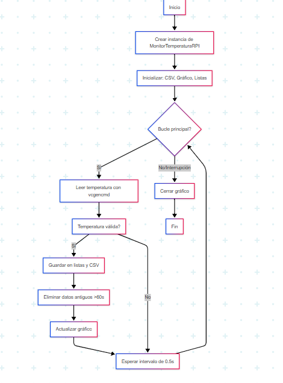

Se explica cada proceso realizo en el codigo

Importaciones

El código importa matplotlib.pyplot para crear gráficos interactivos, time para manejar intervalos y marcas temporales, subprocess para ejecutar comandos del sistema como la lectura de temperatura, csv para guardar datos en formato tabular, y os para verificar y manipular archivos en el sistema. Estas librerías son esenciales para integrar las funcionalidades de monitoreo, almacenamiento y visualización.

Clase MonitorTemperaturaRPI

Esta clase encapsula toda la lógica del programa, inicializando parámetros como la duración máxima del monitoreo (60 segundos) y el intervalo entre lecturas (0.5 segundos). También configura el archivo CSV para almacenar datos y prepara el entorno gráfico interactivo. Su estructura permite un manejo ordenado de los datos y su visualización en tiempo real.

Método __init__

El constructor inicializa las variables clave, como las listas tiempos y temperaturas, y guarda el momento de inicio del monitoreo. Verifica si el archivo CSV existe; si no, lo crea con los encabezados adecuados. Además, configura el gráfico interactivo usando plt.ion() y prepara los ejes para la visualización dinámica de datos.

Método leer_temperatura

Este método ejecuta el comando vcgencmd measure_temp para obtener la temperatura actual de la CPU en formato string. Luego, procesa el texto para extraer el valor numérico, eliminando caracteres innecesarios, y lo convierte a float. Si ocurre un error durante la lectura, muestra un mensaje y retorna None para manejar fallos sin interrumpir el programa.

Método actualizar_datos

Calcula el tiempo transcurrido desde el inicio y obtiene una nueva lectura de temperatura. Si la lectura es válida, añade los datos a las listas correspondientes y los guarda en el CSV. Además, elimina registros antiguos que superen el límite de duracion_max, manteniendo solo los datos relevantes en memoria para optimizar el rendimiento.

Método graficar

Limpia el gráfico anterior y dibuja una nueva línea con los datos actualizados de tiempo y temperatura. Configura el título, etiquetas de los ejes y activa la cuadrícula para mejor legibilidad. Finalmente, actualiza la visualización con draw() y flush_events() para garantizar que los cambios se reflejen en tiempo real.

Método guardar_csv

Abre el archivo CSV en modo de añadido ('a') para preservar los datos previos. Escribe una nueva fila con el tiempo redondeado a dos decimales y la temperatura actual. Este enfoque asegura que los datos se almacenen de forma persistente, permitiendo su análisis posterior sin afectar el rendimiento en tiempo real.

Método ejecutar

Es el bucle principal del programa, que actualiza los datos y el gráfico en cada iteración, respetando el intervalo definido. Detecta interrupciones del usuario (como Ctrl+C) para finalizar el monitoreo de manera controlada. Al terminar, desactiva el modo interactivo de matplotlib y cierra la figura para liberar recursos correctamente.

Bloque principal

Verifica si el script se ejecuta directamente (no como módulo) y, en ese caso, crea una instancia de MonitorTemperaturaRPI e inicia el monitoreo llamando a ejecutar(). Este bloque garantiza que el código solo se ejecute cuando es invocado directamente, facilitando su integración en otros proyectos si fuera necesario.

presentamos el diagrama de flujo

